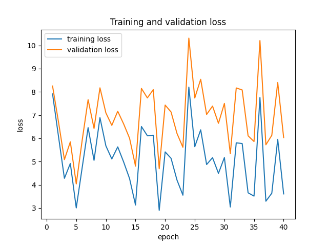
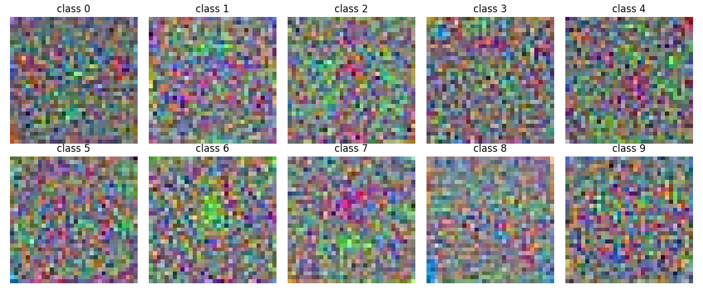
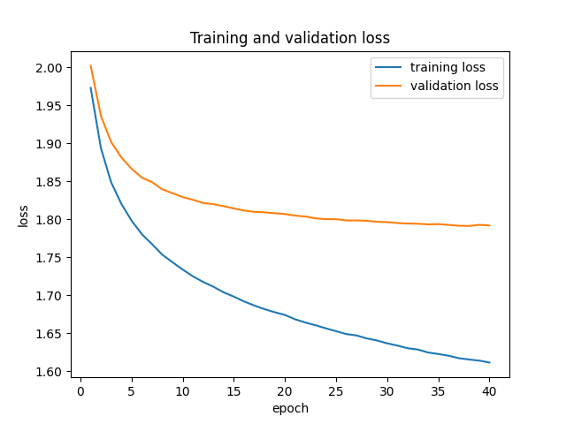
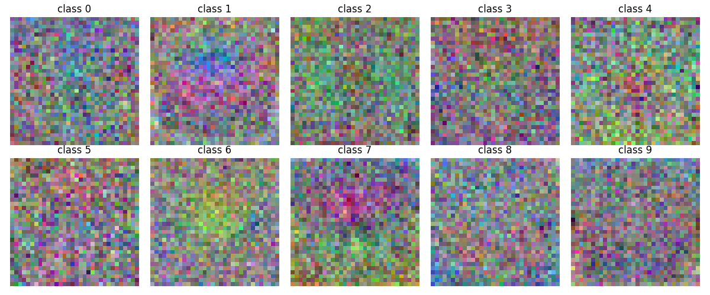
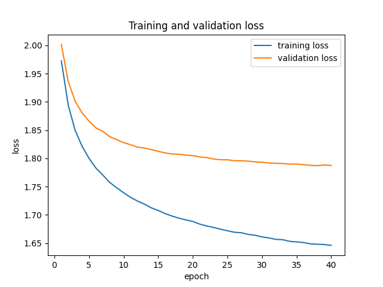
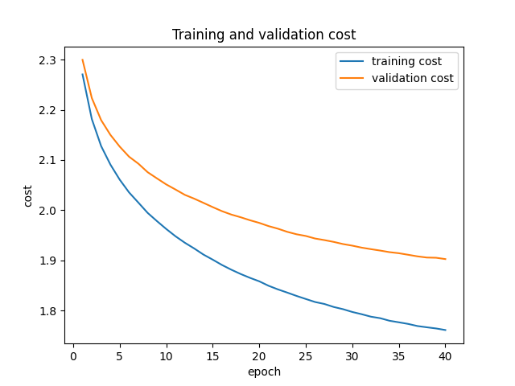
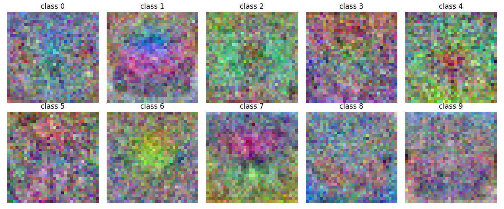
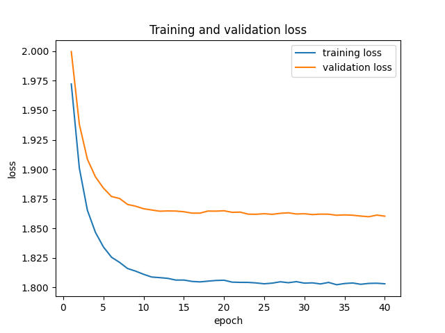
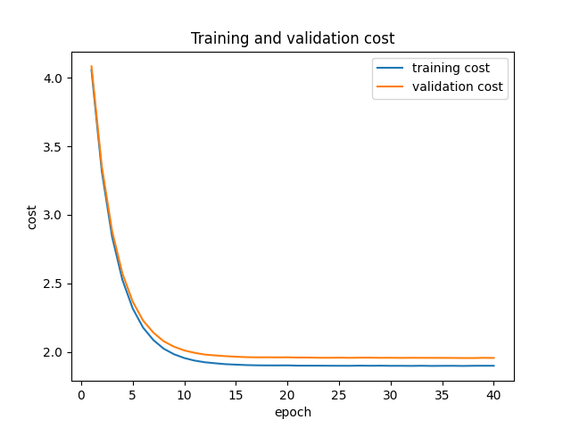
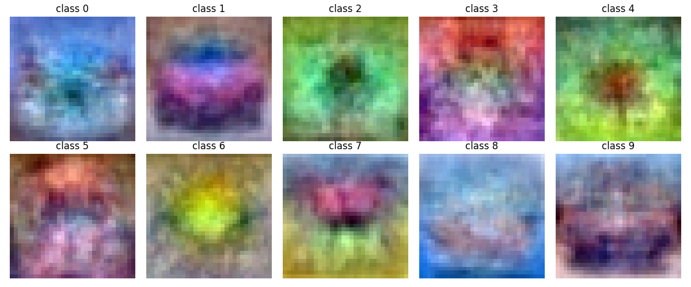

# Assignment 1: One-Layer Neural Network

## Overview
In this assignment, I built a one-layer neural network (a Softmax linear classifier) from scratch to classify images from the CIFAR-10 dataset.

The work involved:
- Preprocessing and normalizing the CIFAR-10 dataset.
- Implementing the forward pass (Softmax activation) and calculating the cross-entropy loss with L2 regularization.
- Deriving and computing the analytical gradients for the backward pass.
- Verifying the custom analytical gradients against PyTorch's auto-differentiation mechanism.
- Training the network using Mini-Batch Gradient Descent.
- Extracting and visualizing the learned weight templates for each class.

## Results
The model was tested using different hyperparameters (learning rate `eta` and regularization penalty `lam`). 

Key training sessions included:

### Test 1: $\lambda = 0$, $\eta = 0.1$
- **Final Accuracy:** ~28.7%
- **Loss and Cost:**
  
  
- **Learned Weights (Classes):**
  

### Test 2: $\lambda = 0$, $\eta = 0.001$
- **Final Accuracy:** ~39.3%
- **Loss and Cost:**
  
  
- **Learned Weights (Classes):**
  

### Test 3: $\lambda = 0.1$, $\eta = 0.001$
- **Final Accuracy:** ~39.4%
- **Loss and Cost:**
  
  
- **Learned Weights (Classes):**
  

### Test 4: $\lambda = 1$, $\eta = 0.001$
- **Final Accuracy:** ~37.4%
- **Loss and Cost:**
  
  
- **Learned Weights (Classes):**
  
