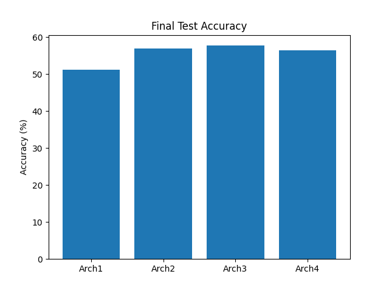
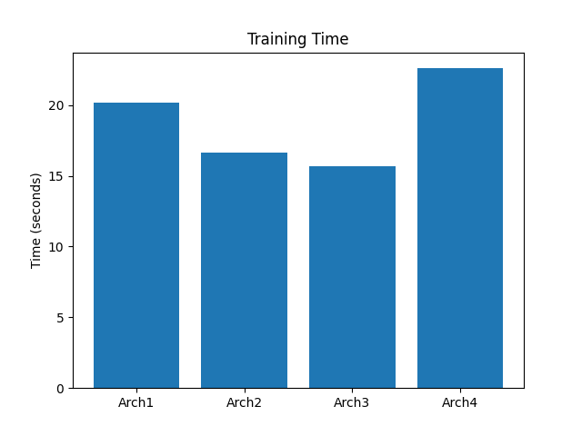

# Assignment 3: Convolutional Neural Networks

## Overview
In this assignment, the focus shifts to spatial data and the implementation of Convolutional Neural Networks (CNNs).

The assignment covers:
- **Efficient Convolution Implementation:** Building a custom forward pass for convolutional layers without relying on nested loops by unrolling image patches to leverage highly optimized matrix multiplications.
- Computing exact analytical gradients for the convolutional filters and verifying them against PyTorch.
- Adding a convolutional bias vector and updating the gradients accordingly.
- Training CNN architectures on the CIFAR-10 dataset with cyclical learning rates.

## Results
The efficient implementation of the convolution significantly sped up the training process. The network successfully learned spatial hierarchies of features, achieving a final test accuracy of approximately 52.6% on CIFAR-10 using the optimally found hyperparameter configurations. Visualizations generated during training and gradient checks are included in the code.

### Architecture Exploration
Various architectures were tested to observe improvements in accuracy:

1. **Architecture 1** (51.26%)
   .png)

2. **Architecture 2** (56.94%)
   .png)

3. **Architecture 3** (57.71%)
   .png)

4. **Architecture 4** (56.44%)
   .png)

### Advanced Techniques
5. **Architecture 5 with Label Smoothing** (66.41%)
   .png)

6. **Architecture 5 Overfitting Analysis** (66.22%)
   .png)

7. **Bumping Number of Filters in Arch 2** (64.57%)
   .png)

8. **Longer Training for Arch 2** (58.55%)
   .png)

9. **Longer Training for Arch 3** (61.31%)
   .png)

### Summary Comparisons
**Accuracy Comparison**

**Training Time Comparison**

